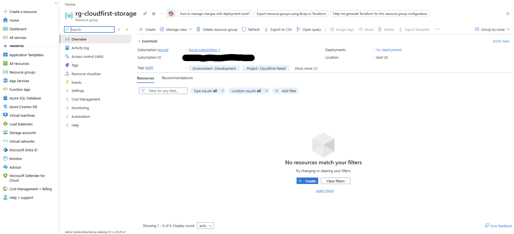
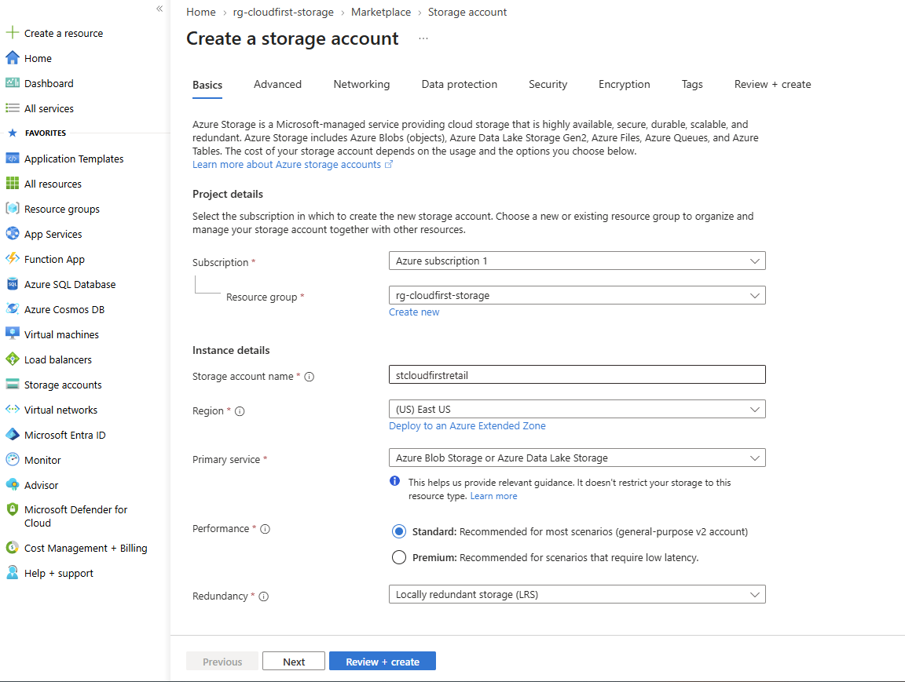
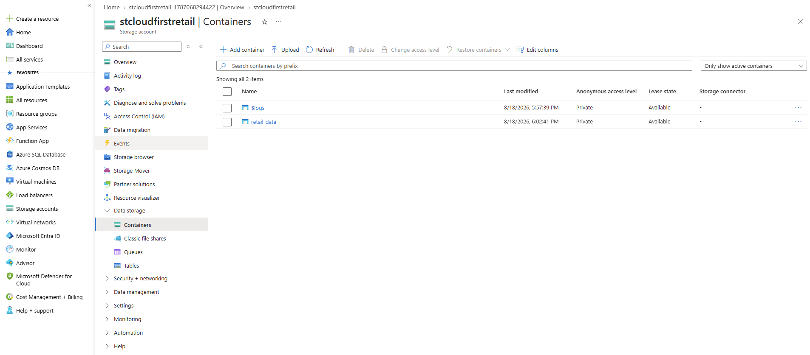
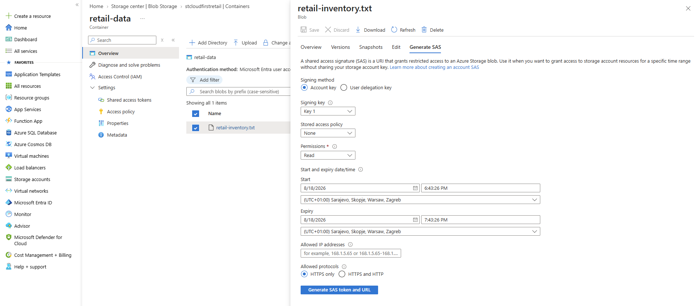
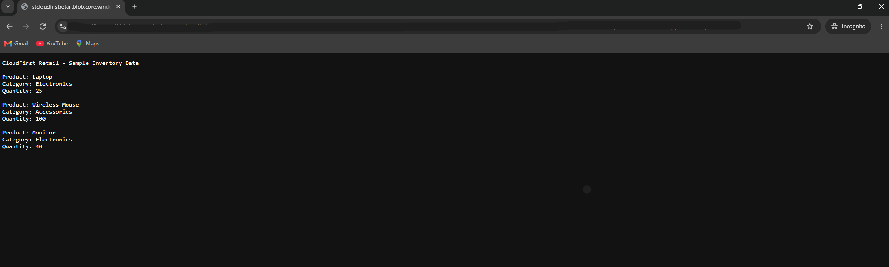
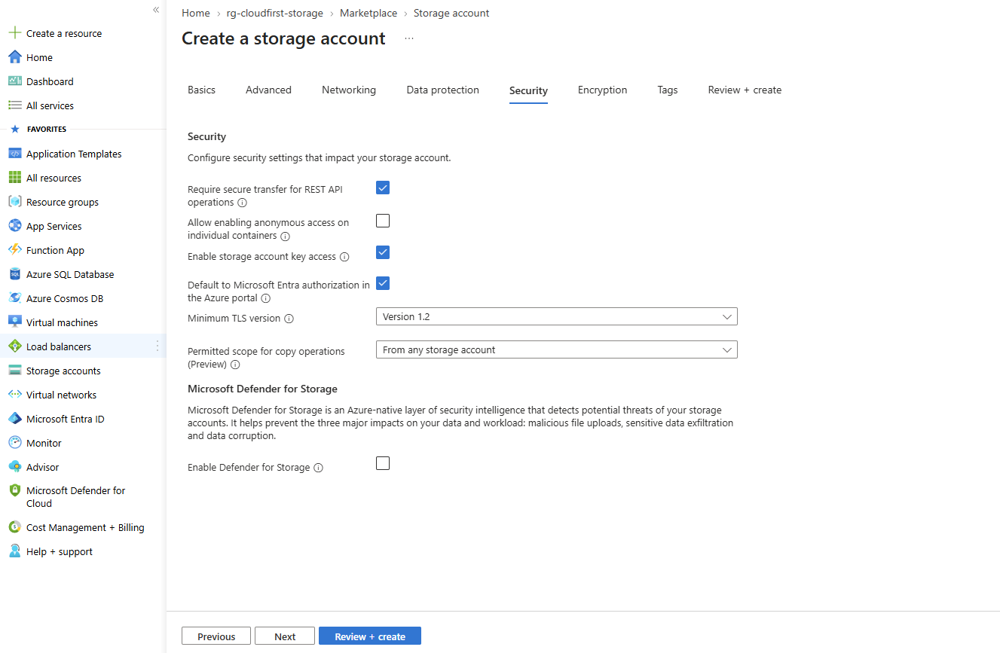
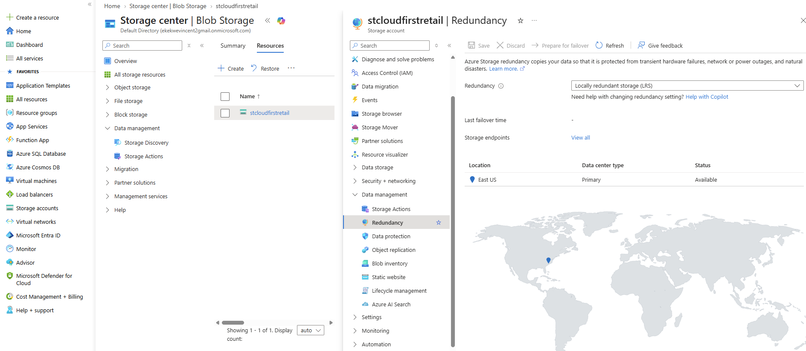

# Azure Storage Management & Secure Access Lab

## Project Overview

This hands-on Azure project demonstrates the deployment, configuration, security, and management of a cloud storage solution using **Microsoft Azure Storage**.

The lab was built around a fictional retail environment, **CloudFirst Retail**, requiring centralized storage for inventory data while maintaining secure access, data protection, controlled sharing, and cost-conscious storage configuration.

The project demonstrates practical experience with Azure Storage Accounts, Blob Storage, access tiers, Shared Access Signatures (SAS), data protection, encryption, redundancy, resource organization, and cloud security principles.

---

## Objectives

The main objectives of this project were to:

- Deploy and configure an Azure Storage Account
- Organize cloud resources using Resource Groups and Tags
- Create and manage Azure Blob Storage
- Configure appropriate Blob access tiers
- Restrict anonymous public access
- Implement controlled access using Shared Access Signatures (SAS)
- Configure data protection using soft delete and versioning
- Review Azure Storage encryption and security settings
- Evaluate storage redundancy options
- Validate secure access to stored data
- Document and clean up Azure resources after completing the lab

---

## Azure Services & Technologies

| Technology | Purpose |
|---|---|
| Microsoft Azure | Cloud platform |
| Azure Storage Account | Central storage service |
| Azure Blob Storage | Object storage for inventory data |
| Azure Resource Groups | Resource organization and lifecycle management |
| Azure RBAC | Identity-based access management |
| Shared Access Signature (SAS) | Temporary delegated access to Blob data |
| Blob Access Tiers | Storage cost and usage optimization |
| Azure Storage Encryption | Data-at-rest protection |
| Soft Delete | Recovery of accidentally deleted data |
| Blob Versioning | Protection against unintended changes |
| Azure Storage Redundancy | Data availability and durability |

---

## Solution Overview

The environment was organized around a dedicated Azure Resource Group containing a **StorageV2** account used to host retail inventory data.

The implementation incorporated several cloud storage and security principles:

- Private Blob container access
- Role-based access control
- HTTPS-secured access
- Time-limited SAS authorization
- Read-only delegated access
- Blob versioning
- Soft delete protection
- TLS 1.2
- Azure Storage encryption
- Locally Redundant Storage (LRS)
- Resource tagging

This provided a practical example of managing cloud storage while balancing **security, availability, recoverability, and cost**.

---

# Implementation

## 1. Resource Organization

A dedicated Resource Group was created to keep storage-related resources logically grouped and simplify management and eventual cleanup.

Resource tagging was also used to identify the environment and project.

Example tags included:

- `Environment: Development`
- `Project: CloudFirst-Retail`



---

## 2. Azure Storage Account

A general-purpose **StorageV2** account was deployed as the primary storage platform for the project.

The configuration included:

- Standard performance
- StorageV2 account type
- Secure transfer enabled
- Minimum TLS version 1.2
- Blob anonymous access disabled



---

## 3. Blob Storage

A private Blob container named `retail-data` was created to store sample retail inventory information.

A sample inventory file was uploaded containing product information for items such as:

- Laptop
- Wireless Mouse
- Monitor

The container was configured without anonymous public access, ensuring authorization was required to access the stored data.



---

## 4. Blob Access Tiers

Azure Blob access tiers were reviewed as part of the storage management strategy.

Access tiers allow organizations to balance storage costs against how frequently data needs to be accessed.

This demonstrated an understanding of storage lifecycle and cost optimization concepts for frequently and infrequently accessed cloud data.

---

## 5. Secure Access with SAS

A **Shared Access Signature (SAS)** was generated for the inventory Blob to demonstrate temporary delegated access.

The SAS configuration used:

- **Read-only permission**
- **HTTPS-only access**
- **Limited expiration period**

The generated SAS URL was successfully tested in a separate browser session, confirming that the inventory file could be accessed without exposing the Storage Account key.

> **Security Note:** Sensitive SAS tokens and URLs were intentionally excluded from repository screenshots.





---

## 6. Storage Security & Data Protection

Several Azure Storage security and recovery capabilities were reviewed and configured.

Key settings included:

- Secure transfer required
- Minimum TLS version 1.2
- Blob anonymous access disabled
- Storage encryption enabled
- Blob soft delete enabled
- Container soft delete enabled
- Blob versioning enabled

These controls help protect stored data against unauthorized access, accidental deletion, and unintended modification.



---

## 7. Storage Redundancy

Azure Storage redundancy options were reviewed to understand how Azure protects data against infrastructure failures.

The Storage Account used:

**Locally Redundant Storage (LRS)**

LRS maintains multiple copies of data within a single Azure region and provides a cost-effective redundancy option for workloads that do not require geographic replication.

Other redundancy models such as **ZRS, GRS, and RA-GRS** were also reviewed during the lab.



---

# Security Decisions

Security was an important part of this project.

| Security Control | Implementation |
|---|---|
| Anonymous Blob Access | Disabled |
| SAS Permission | Read only |
| SAS Lifetime | Time limited |
| SAS Protocol | HTTPS only |
| Secure Transfer | Required |
| Minimum TLS | TLS 1.2 |
| Blob Soft Delete | Enabled |
| Container Soft Delete | Enabled |
| Blob Versioning | Enabled |
| Storage Encryption | Enabled |

These settings demonstrate the principle of providing only the access required while maintaining recovery options for stored data.

---

# Skills Demonstrated

This project provided hands-on experience with:

- Azure Storage Account deployment
- Azure Blob Storage
- Azure Resource Groups
- Azure resource tagging
- Blob access tiers
- Shared Access Signatures (SAS)
- Azure RBAC concepts
- Secure cloud data access
- Azure Storage encryption
- TLS and HTTPS security
- Blob soft delete
- Container soft delete
- Blob versioning
- Storage redundancy
- Cloud cost awareness
- Azure Portal administration
- Cloud resource lifecycle management
- Technical documentation

---

# Project Structure

```text
azure-storage-management-secure-access-lab/
│
├── README.md
├── KEY-LEARNINGS.md
│
└── Screenshots/
    ├── 01-resource-group/
    ├── 02-storage-account/
    ├── 03-blob-storage/
    ├── 04-access-tiers/
    ├── 05-sas-secure-access/
    ├── 06-storage-security/
    ├── 07-redundancy/
    └── 08-storage-review/
```

---

# Key Learnings

This project strengthened my understanding of how Azure Storage combines **storage management, security, availability, data protection, and cost optimization**.

Key takeaways included:

- Storage Accounts provide multiple Azure storage services under a single resource.
- Blob containers should remain private unless public access is specifically required.
- SAS provides a safer method of granting temporary access than exposing Storage Account keys.
- SAS permissions and expiration times should be kept as restrictive as practical.
- HTTPS and TLS protect data while it is being transmitted.
- Azure Storage encrypts stored data at rest.
- Soft delete and versioning provide additional protection against accidental data loss.
- Storage redundancy should be selected according to availability requirements, disaster recovery needs, and cost.

More detailed technical observations are documented in **[KEY-LEARNINGS.md](KEY-LEARNINGS.md)**.

---

# Resource Cleanup

After completing and documenting the lab, the dedicated Azure Resource Group was deleted.

Deleting the Resource Group removed the Storage Account and its dependent resources, helping prevent unnecessary Azure consumption and demonstrating proper **cloud resource lifecycle and cost management**.

---

# Project Outcome

The lab successfully demonstrated the deployment and management of a secure Azure Blob Storage environment from initial resource organization through secure data access, protection, redundancy review, validation, documentation, and final resource cleanup.

This project provides practical evidence of foundational skills relevant to **Cloud Support, Azure Administration, IT Infrastructure, and Junior Cloud Engineering** roles.
